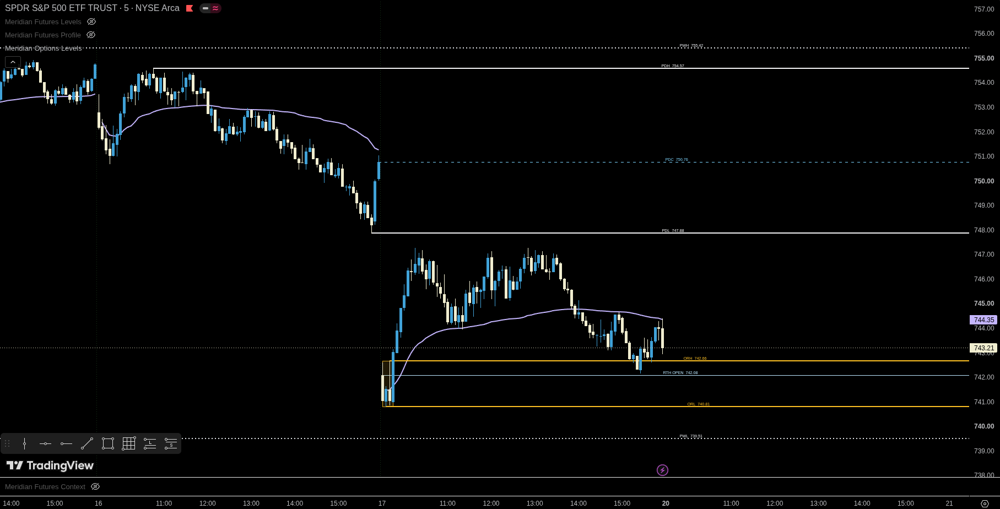
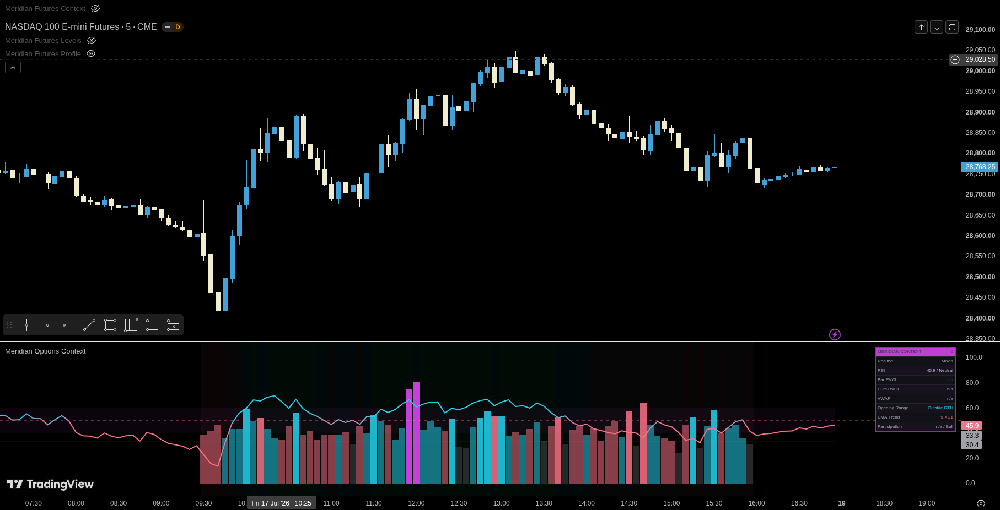
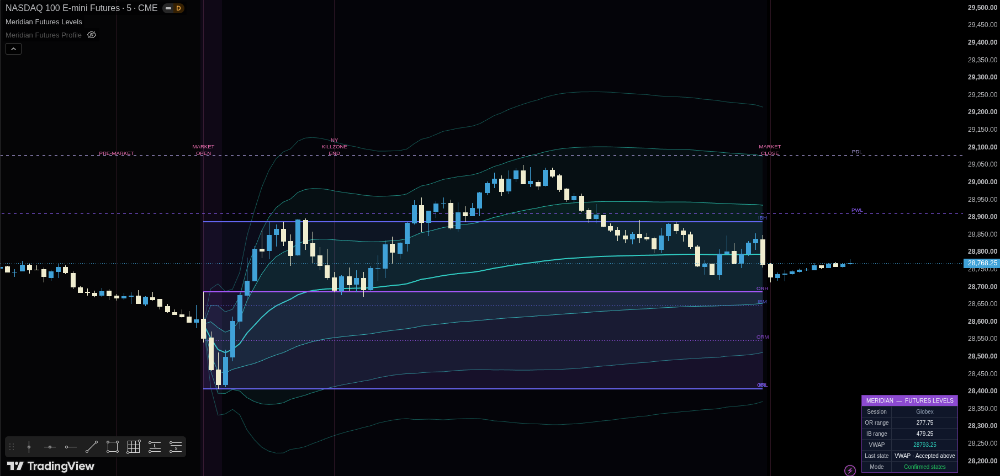
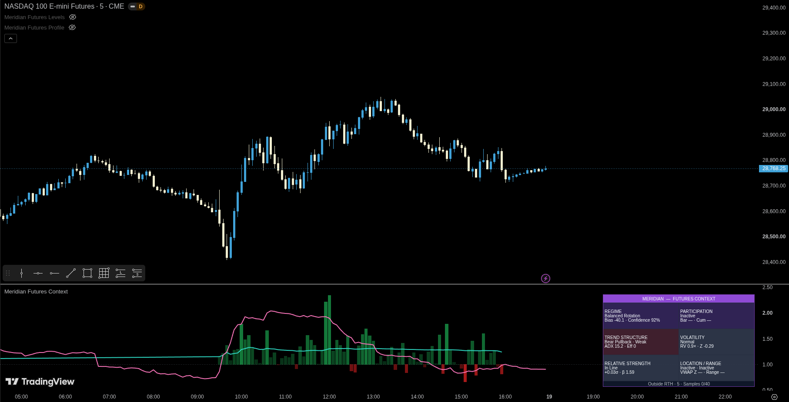

UPDATE JUNE 27. -ss

<p align="center">
  
</p>

<h1 align="center">Meridian Indicators</h1>

<p align="center">
  Open-source TradingView indicators for structured intraday analysis across options underlyings and index futures.
</p>

<p align="center">
  
  
  
  
  
</p>

## Overview

**Meridian Indicators** is the public TradingView indicator suite from **Meridian Trading**. The project separates intraday analysis into focused tools:

- **Levels** identifies important session, historical, volatility and confluence references.
- **Context** describes participation, momentum, volatility, relative strength and market regime.
- **Profile** shows where the futures auction accepts value and how that value changes.
- **Setups** ranks multi-timeframe market confluence and produces a temporary trade hypothesis only after the complete qualification model passes.

The scripts are written in Pine Script v6 and remain fully inspectable. Each indicator documents its calculations, limits and intended use. Meridian indicators are analytical tools. They do not place broker orders and do not guarantee a trade outcome.

## Indicator Suite

| Indicator | Market | Type | Primary purpose | Status | Documentation | Source |
|---|---|---|---|---|---|---|
| **Meridian — Options Levels** | SPY, QQQ and other liquid option underlyings | Overlay | Prior-session levels, premarket structure, Opening Range, RTH VWAP and optional EMA filters | Stable development release | [Read docs](./docs/meridian-options-levels.md) | [View Pine](./indicators/options/meridian-options-levels/meridian-options-levels.pine) |
| **Meridian — Options Context** | SPY, QQQ and other liquid option underlyings | Lower pane | RSI, same-time RVOL, VWAP/OR/EMA agreement and a transparent context score | Stable development release | [Read docs](./docs/meridian-options-context.md) | [View Pine](./indicators/options/meridian-options-context/meridian-options-context.pine) |
| **Meridian — Futures Levels** | NQ, ES, MNQ, MES and related futures | Overlay | Session structure, OR, IB, custom VWAP bands, references, projections, clusters and level states | Stable development release | [Read docs](./docs/meridian-futures-levels.md) | [View Pine](./indicators/futures/meridian-futures-levels/meridian-futures-levels.pine) |
| **Meridian — Futures Context** | NQ, ES, MNQ and MES | Lower pane | Same-time participation, realized volatility, regime, EMA/ADX structure and relative strength | Stable development release | [Read docs](./docs/meridian-futures-context.md) | [View Pine](./indicators/futures/meridian-futures-context/meridian-futures-context-v0.1.6.pine) |
| **Meridian — Futures Profile** | NQ, ES, MNQ and MES | Overlay | Current/previous TPO profiles, value area, profile structure and Auction Market Theory context | Active development | [Read docs](./docs/meridian-futures-profile.md) | [View Pine](./indicators/futures/meridian-futures-profile/meridian-futures-profile-v0.1.1.pine) |
| **Meridian — Futures Setups** | NQ, ES, MNQ and MES | Overlay | Strategy-neutral Meridian Choice scanner for multi-timeframe zones, structure, liquidity, context and confirmed trade hypotheses | **Beta · Work in progress** | [Read docs](./docs/meridian-futures-setups.md) | [Daily build](./indicators/futures/meridian-futures-setups/meridian-futures-setups-v0.3.0-beta.pine)<br>[Research build](./indicators/futures/meridian-futures-setups/meridian-futures-setups-research-v0.3.0-beta.pine) |

## Screenshots

<table>
  <tr>
    <td width="50%" valign="top">
      <a href="./docs/meridian-options-levels.md"></a>
      <br><b>Options Levels</b><br>
      Session-aware references for liquid option underlyings.
    </td>
    <td width="50%" valign="top">
      <a href="./docs/meridian-options-context.md"></a>
      <br><b>Options Context</b><br>
      Momentum, participation and directional agreement in one pane.
    </td>
  </tr>
  <tr>
    <td width="50%" valign="top">
      <a href="./docs/meridian-futures-levels.md"></a>
      <br><b>Futures Levels</b><br>
      RTH/overnight structure, VWAP, OR, IB and confluence zones.
    </td>
    <td width="50%" valign="top">
      <a href="./docs/meridian-futures-context.md"></a>
      <br><b>Futures Context</b><br>
      Participation, volatility, relative strength and regime classification.
    </td>
  </tr>
  <tr>
    <td width="50%" valign="top">
      <a href="./docs/meridian-futures-profile.md"></a>
      <br><b>Futures Profile</b><br>
      TPO value, structure, migration and auction-state interpretation.
    </td>
    <td width="50%" valign="top">
      <a href="./docs/meridian-futures-setups.md"></a>
      <br><b>Futures Setups — Beta</b><br>
      Multi-timeframe confluence scoring with separate daily-use and research builds.
    </td>
  </tr>
</table>

## Quick Start

### Install an indicator in TradingView

1. Open the indicator's `.pine` file from the **Source** column above.
2. Copy the complete source code.
3. Open a chart in TradingView.
4. Select **Pine Editor**.
5. Create a blank indicator and replace its contents with the Meridian source.
6. Save the script and select **Add to chart**.
7. Open the indicator settings and confirm the session timezone, market session and display options.

### Download the repository

Use GitHub's **Code** menu to clone the repository or download it as a ZIP. Indicator source files are stored under `indicators/`. Documentation and screenshots are stored under `docs/` and `screenshots/`.

```bash
git clone https://github.com/YOUR_USERNAME/meridian-indicators.git
cd meridian-indicators
```

Replace `YOUR_USERNAME` with the repository owner before publishing this command.

### Update an installed script

TradingView does not automatically update source copied from GitHub.

1. Open the latest source file in this repository.
2. Review the commit history and changelog.
3. Copy the updated source.
4. Replace the source in your saved TradingView script.
5. Save the script and refresh or re-add it to the chart.

Git commit history and source diffs make each public change reviewable.

## Recommended Chart Setup

### Options indicators

- Apply the scripts to the underlying chart, such as SPY or QQQ, not to an individual option contract.
- Use standard time-based candles.
- Typical working timeframes are 1, 2, 3, 5 and 15 minutes.
- Enable extended hours when premarket levels are required.

### Futures Levels, Context and Profile

- Designed primarily for NQ, ES, MNQ and MES.
- Use standard candles rather than synthetic chart types.
- Use the active contract for live execution context. Continuous contracts are convenient for research but can be affected by rollover and back-adjustment.
- One-minute, five-minute and fifteen-minute charts provide the best alignment for intraday session calculations.
- Confirm the chart timezone and session configuration when calculations appear offset.

### Futures Setups beta

Use the **daily build** for normal chart use and the **research build** only when you need scoring diagnostics.

Recommended initial configuration:

```text
Market: NQ or ES
Timeframe: 1 minute
Extended hours: enabled
Signal window: 08:00–16:00 ET
Minimum score: 80
Minimum independent categories: 4
Entry mode: Rejection close
Require first qualified touch: enabled
Maximum active trades: 1
```

The zone engine reads the configured futures session, including overnight and premarket bars. The default signal window begins at 08:00 New York time and can be changed in the settings.

Futures Setups is a **beta and work in progress**. Score weights, zone rules, thresholds and lifecycle behavior can change during validation.

## Suggested Workflows

### Options workflow

Use **Options Levels** on the price chart and **Options Context** in a lower pane.

- Levels supplies PDH/PDL, premarket, Opening Range and VWAP references.
- Context shows whether momentum and participation support or conflict with price at those references.

### Futures analysis workflow

Use **Futures Levels**, **Futures Context** and **Futures Profile** together.

- Levels answers: *Where are the objective references and confluence zones?*
- Context answers: *Is the session trending, balancing, expanding or compressing?*
- Profile answers: *Where is value forming, migrating or failing?*

The Profile dashboard includes a layout option intended to stack with the Futures Levels dashboard.

### Futures setup workflow

Use **Futures Setups Daily** when you want a clean Meridian Choice signal scanner.

- The script detects chart, 5-minute, 15-minute, 30-minute, 1-hour and 4-hour FVG, IFVG, OB and BB zones.
- It evaluates nesting, structure, displacement, liquidity, VWAP, momentum, RVOL, SMT and session context.
- It selects the strongest qualified zone on each confirmed bar.
- It produces full BUY/SELL trade geometry only after the live score and lifecycle gates pass.

Use **Futures Setups Research** to inspect active zones, score composition, rejected candidates and score-bucket outcomes. Research visibility does not lower the live threshold and does not convert rejected candidates into trades.

Futures Setups recalculates the information that it requires. It does not directly read the internal object state of Futures Levels, Context or Profile.

## Repository Layout

```text
meridian-indicators/
├── README.md
├── LICENSE
├── docs/
│   ├── README.md
│   ├── meridian-options-levels.md
│   ├── meridian-options-context.md
│   ├── meridian-futures-levels.md
│   ├── meridian-futures-context.md
│   ├── meridian-futures-profile.md
│   └── meridian-futures-setups.md
├── indicators/
│   ├── options/
│   │   ├── meridian-options-levels/
│   │   └── meridian-options-context/
│   └── futures/
│       ├── meridian-futures-levels/
│       ├── meridian-futures-context/
│       ├── meridian-futures-profile/
│       └── meridian-futures-setups/
│           ├── meridian-futures-setups-v0.3.0-beta.pine
│           └── meridian-futures-setups-research-v0.3.0-beta.pine
└── screenshots/
    ├── Meridian_Options_Levels.png
    ├── Meridian_Options_Context.png
    ├── Meridian_Futures_Levels.png
    ├── Meridian_Futures_Context.png
    ├── Meridian_Futures_Profile.png
    └── Meridian_Futures_Setups.png
```

## Design Principles

- **Transparent:** source code and calculation logic are public.
- **Explainable:** classifications and setup states use documented rules rather than unexplained labels.
- **Focused:** each indicator has one primary analytical purpose.
- **Session-aware:** intraday calculations use explicit market-session boundaries.
- **Confirmed where required:** completed higher-timeframe values and confirmed pivots are used on critical setup paths.
- **Stateful:** zones, levels and setup hypotheses progress through explicit lifecycles.
- **Strategy-neutral:** Futures Setups ranks shared market evidence instead of embedding multiple named playbooks.
- **Customizable:** sessions, thresholds, visual styles and display density are configurable.
- **Composable:** each indicator can be used independently or with the Meridian suite.
- **Bounded:** drawing objects and retained history are limited to respect Pine Script resource constraints.

## Documentation

Detailed documentation is available for every current indicator:

- [Meridian — Options Levels](./docs/meridian-options-levels.md)
- [Meridian — Options Context](./docs/meridian-options-context.md)
- [Meridian — Futures Levels](./docs/meridian-futures-levels.md)
- [Meridian — Futures Context](./docs/meridian-futures-context.md)
- [Meridian — Futures Profile](./docs/meridian-futures-profile.md)
- [Meridian — Futures Setups — Beta](./docs/meridian-futures-setups.md)

The [documentation index](./docs/README.md) provides a compact list of all indicator guides.

## Development Status

The repository is under active development. Public scripts can receive calculation fixes, usability improvements, alerts, documentation changes and visual refinements.

**Meridian — Futures Setups v0.3 is a beta and work in progress.** The legacy multi-strategy design was replaced with one strategy-neutral Meridian Choice engine and two separate builds:

- daily use;
- research and diagnostics.

Validation priorities include Bar Replay timing, live-session observation, score-bucket analysis, multi-timeframe zone accuracy and later Meridian Backtester research.

Review the commit history before updating a script so that you understand what changed. Reproducible chart examples and bug reports are welcome through GitHub Issues once issue tracking is enabled.

## Planned Work

Current research and development areas include:

- Futures Setups score and threshold validation;
- a dedicated historical research/strategy companion;
- separate hypothesis-specific indicators such as mean reversion and session-liquidity models;
- Futures Auction and footprint research;
- constituent and intermarket pressure models;
- secure Meridian Intelligence integrations.

## Disclaimer

These indicators are research and market-analysis tools. They do not provide financial advice, guarantee a result, place broker orders or replace independent risk management. Historical references, statistical classifications, setup scores and alerts can fail or become less useful when market structure changes.

Futures Setups uses OHLC bars. Historical bars do not reveal the exact intrabar sequence when a stop and target occur in the same candle. The confluence score is not a probability, win rate or promise of future performance.

<a id="license"></a>
## License

The source code in this repository is licensed under the [Mozilla Public License 2.0](./LICENSE).

The MPL-2.0 permits use, study, modification and redistribution under its terms. The license applies to covered source code. It does not grant rights to the **Meridian Trading** name, logos, branding, premium products or private infrastructure.

---

<p align="center">
  Developed by <b>Meridian Trading</b>.
</p>
