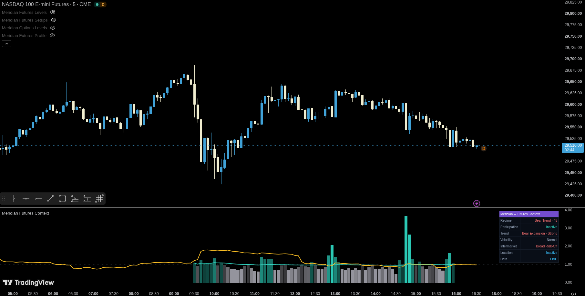

<p align="center">
  
</p>

<h1 align="center">Meridian Indicators</h1>

<p align="center">
  Open-source TradingView indicators for structured intraday analysis of liquid options underlyings and US index futures.
</p>

<p align="center">
  
  
  
  
</p>


## Start here

Meridian separates market analysis into focused tools instead of combining every concept into one chart script.

1. Choose an indicator from the catalog below.
2. Open its source file and copy the complete Pine Script.
3. In TradingView, open **Pine Editor**, paste the source into a blank indicator, save it, and select **Add to chart**.

New to TradingView scripts? Read the [installation and setup guide](./docs/getting-started.md). Technical users can start with the [architecture](./docs/architecture.md) and [data-integrity model](./docs/data-integrity.md).

Join our Community Discord server, [Meridian Desk](google.com).

## Indicator catalog

| Indicator | Market | What it answers | Status | Source | Guide |
|---|---|---|---|---|---|
| **Options Levels** | SPY, QQQ and other liquid underlyings | Where are the main session, prior-day, prior-week, Opening Range and VWAP references? | Stable | [Pine](./src/options/meridian-options-levels.pine) | [Guide](./docs/indicators/options-levels.md) |
| **Options Context** | SPY, QQQ and other liquid underlyings | Do momentum, relative volume, VWAP, Opening Range and EMA structure agree? | Stable | [Pine](./src/options/meridian-options-context.pine) | [Guide](./docs/indicators/options-context.md) |
| **Futures Levels** | NQ, MNQ, ES and MES | Where are the objective session levels, projections and confluence clusters? | Stable | [Pine](./src/futures/meridian-futures-levels.pine) | [Guide](./docs/indicators/futures-levels.md) |
| **Futures Context** | NQ, MNQ, ES and MES | Is participation, volatility, trend quality and relative strength consistent with the current regime? | Stable | [Pine](./src/futures/meridian-futures-context.pine) | [Guide](./docs/indicators/futures-context.md) |
| **Futures Profile** | NQ, MNQ, ES and MES | Where is the auction accepting value, and how is the profile developing? | Preview | [Pine](./src/futures/meridian-futures-profile.pine) | [Guide](./docs/indicators/futures-profile.md) |
| **Futures Setups** | NQ, MNQ, ES and MES | Has one multi-timeframe zone passed the complete Meridian Choice qualification model? | Beta | [Daily](./src/futures/meridian-futures-setups.pine) · [Research](./src/futures/meridian-futures-setups-research.pine) | [Guide](./docs/indicators/futures-setups.md) |

**Status meanings:** Stable scripts are the recommended public builds. Preview scripts are usable but still undergoing calculation and interface refinement. Beta scripts require active validation and can change materially between versions.

The machine-readable [manifest](./manifest.json) records the current source paths, versions and status labels.

## Screenshots

<table>
  <tr>
    <td width="50%" valign="top"><a href="./docs/indicators/options-levels.md"></a><br><b>Options Levels</b><br>Session and historical references for liquid options underlyings.</td>
    <td width="50%" valign="top"><a href="./docs/indicators/options-context.md"></a><br><b>Options Context</b><br>Momentum, participation and directional agreement in a lower pane.</td>
  </tr>
  <tr>
    <td width="50%" valign="top"><a href="./docs/indicators/futures-levels.md"></a><br><b>Futures Levels</b><br>Session structure, VWAP, OR, IB and confluence clusters.</td>
    <td width="50%" valign="top"><a href="./docs/indicators/futures-context.md"></a><br><b>Futures Context</b><br>Participation, volatility, relative strength and regime classification.</td>
  </tr>
  <tr>
    <td width="50%" valign="top"><a href="./docs/indicators/futures-profile.md"></a><br><b>Futures Profile</b><br>TPO value, profile structure and auction-state interpretation.</td>
    <td width="50%" valign="top"><a href="./docs/indicators/futures-setups.md"></a><br><b>Futures Setups</b><br>Confirmed multi-timeframe confluence and trade-hypothesis geometry.</td>
  </tr>
</table>

## Recommended combinations

### Options workflow

Apply **Options Levels** to the underlying price chart and **Options Context** in a lower pane. Use the underlying, such as SPY or QQQ, rather than an individual option contract.

### Futures workflow

Use **Futures Levels**, **Futures Context** and **Futures Profile** together when you want separate answers to three questions:

- **Location:** where are the objective references?
- **Environment:** is the session trending, balancing, expanding or compressing?
- **Auction:** where is value forming, migrating or failing?

Use **Futures Setups** independently when you want the beta Meridian Choice qualification engine. The daily and research builds share the same live signal rules; the research build adds diagnostic drawings and outcome counters.

## Repository layout

```text
meridian-indicators/
├── src/
│   ├── options/                 # Stable options-underlying scripts
│   └── futures/                 # Stable, preview and beta futures scripts
├── docs/
│   ├── indicators/              # One practical guide per indicator
│   ├── getting-started.md       # Installation and first configuration
│   ├── architecture.md          # Technical design and boundaries
│   ├── data-integrity.md        # Confirmation, repainting and data behavior
│   └── troubleshooting.md       # Common setup and runtime problems
├── assets/                      # Banner and chart screenshots
├── tools/validate_repo.py       # Dependency-free static repository checks
├── manifest.json                # Versions, paths and release status
├── CHANGELOG.md
├── CONTRIBUTING.md
├── SECURITY.md
├── DISCLAIMER.md
├── LICENSE
└── README.md
```

## Design principles

- **Focused:** every script has one primary analytical responsibility.
- **Explainable:** scores and labels are based on documented rules.
- **Session-aware:** intraday calculations use explicit market-session boundaries.
- **Confirmed where required:** critical higher-timeframe values use completed source bars.
- **Bounded:** drawing objects and historical state are capped to respect Pine limits.
- **Composable:** scripts can be used independently or as a suite.
- **Private by default:** the scripts contain no credentials and cannot directly transmit chart data. TradingView only sends alert data after a user creates an alert and chooses a delivery destination.

## Validation

Run the included static checks before opening a pull request:

```bash
python tools/validate_repo.py
```

The validator checks the manifest, source headers, local documentation links, balanced delimiters, setup-build parity and common release mistakes. It does **not** replace compiling each script in TradingView or validating it with Bar Replay and live market data.

## Contributing

Bug reports and focused improvements are welcome. Read [CONTRIBUTING.md](./CONTRIBUTING.md) before submitting a change. Calculation changes should include a reproducible chart case, symbol, timeframe, session settings and expected behavior.

## License and risk notice

Source code is licensed under the [Mozilla Public License 2.0](./LICENSE). See [DISCLAIMER.md](./DISCLAIMER.md) for the trading and market-data notice.
