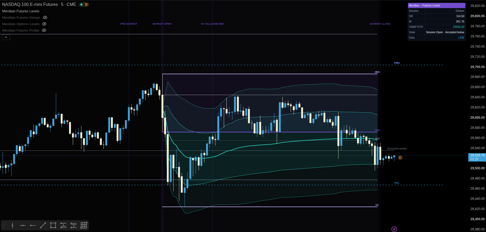

# Meridian — Futures Levels

[← Indicator documentation](../README.md) · [View source](../../src/futures/meridian-futures-levels.pine)

**Version:** 0.1.5<br>
**Status:** Stable<br>
**Primary markets:** NQ, MNQ, ES and MES

<p align="center"></p>

## Purpose

Futures Levels is a session-aware overlay for objective index-futures references, custom VWAP, projected levels and confluence clusters. It describes **location and confirmed interaction with location**; it does not predict direction.

The script is designed around CME-style index-futures sessions. RTH-oriented calculations can also be inspected on symbols such as SPY, but futures-session and overnight semantics should not be treated as authoritative on non-futures symbols. For SPY/QQQ options-underlying workflows, use [Options Levels](./options-levels.md).

## Main features

- full-session, overnight and RTH structure;
- robust session identity across RTH-only charts, maintenance gaps, weekends and holidays;
- futures-session and RTH opens;
- overnight high, low and optional midpoint;
- configurable Opening Range and Initial Balance;
- custom session VWAP with volume-weighted or unweighted deviation bands;
- RTH, full-session or weekly VWAP anchors;
- confirmed previous-day and previous-week references;
- configurable Fibonacci retracements and symmetric range projections;
- clustering across independent level families;
- confirmed acceptance and rejection states;
- compact HUD with data-freshness information;
- optional vertical session-time markers;
- static alerts and optional dynamic JSON state alerts.

## Recommended setup

```text
Market: active NQ, MNQ, ES or MES contract
Chart: 1–15 minutes, standard candles
Extended hours: enabled
Timezone: America/New_York
Full session: 18:00–17:00 ET
Overnight: 18:00–09:30 ET
RTH: 09:30–16:00 ET
VWAP anchor: RTH or Full Futures Session
```

Charts up to 30 minutes are supported by the interface, but 15 minutes or lower is preferred for OR, IB and state timing.

## Session identity and reset behavior

v0.1.5 no longer assumes that an out-of-session chart bar must exist between two sessions. That assumption fails on RTH-only charts and across futures maintenance gaps.

RTH session changes are identified from the configured session together with the local calendar date in `America/New_York` by default. Full-futures and overnight session changes use the symbol's trading-day identity. This allows a new session to initialize even when the previous available chart bar was also technically inside the same clock-session string.

This reset model controls:

- RTH open;
- futures-session open;
- current RTH high/low and custom-RTH previous-day rollover;
- overnight high/low;
- OR and IB initialization;
- RTH and full-session VWAP anchors.

Week-anchored VWAP resets on the first available bar of the new TradingView week. A market holiday does not create synthetic bars; the reset occurs when the next real bar arrives.

## Opening Range and Initial Balance

The Opening Range and Initial Balance are tracked from the configured RTH open. Developing levels can be displayed while their collection windows are active, then freeze when complete.

The default Opening Range is 15 minutes and the default Initial Balance is 60 minutes. Finer chart timeframes align more precisely with start and end boundaries.

OR and IB values are cleared when a new RTH identity begins, including when the chart contains only RTH bars.

## VWAP engine

The script maintains its own cumulative VWAP and deviation engine. Available anchors are:

- **RTH** — resets on each new configured RTH session;
- **Full Futures Session** — resets on each new futures trading day;
- **Week** — resets on the first available bar of each new week.

For a price source `P` and volume `V`, the VWAP is:

```text
VWAP = Σ(P × V) / ΣV
```

The volume-weighted deviation method uses the cumulative weighted second moment. The unweighted method calculates dispersion from chart-bar source prices with equal bar weights.

Bands can be shown at three configurable multipliers. By default Band 1 is ±1σ and Band 2 is ±2σ.

### Session-reset correction in v0.1.5

Earlier builds detected a new RTH with `inRTH and not inRTH[1]`. On an RTH-only chart, Friday's last bar and the next trading day's first bar can both report `inRTH = true`, causing the VWAP accumulator to carry multiple days together. The same pattern could affect full-session futures data across the daily maintenance gap.

v0.1.5 uses explicit session identities instead. As a result, RTH and full-session VWAP, variance and deviation bands restart with the correct source session rather than accumulating old sessions.

`Carry VWAP outside anchor session` controls presentation only; it does not prevent the next anchor reset.

## Confirmed references

Previous-day and previous-week exchange references come from completed higher-timeframe bars using confirmed-source offsets.

When `Previous-day source` is set to `Custom RTH session`, the prior RTH high/low are rolled forward only when a new RTH session identity begins. This now works on RTH-only charts because it does not require an extended-hours boundary bar.

Reference state also carries a source-period identity. When the previous day or week changes, acceptance/rejection history is reset even if the new level happens to be very close to the old price.

## Confluence clusters

Enabled level families are grouped when their prices fall within the selected tick- or ATR-based tolerance. Candidate families can include:

- previous day/week;
- OR / IB / overnight;
- active session opens;
- VWAP and enabled bands;
- visible Fibonacci levels.

A cluster requires the configured minimum number of contributors. The displayed cluster summarizes nearby calculated references; it does not prove resting liquidity or order concentration.

RTH Open is eligible only during the active RTH session, and Futures Session Open is eligible only during the active full futures session. This prevents stale session opens from affecting unrelated periods.

## Acceptance and rejection

Tracked levels can produce four confirmed events:

- accepted above;
- accepted below;
- bullish rejection;
- bearish rejection.

Acceptance requires the configured number of closes beyond the level plus the acceptance buffer. Rejection requires a prior-side relationship, a current test and a confirming close back away with the configured minimum wick.

For moving references such as VWAP and ±1σ, the previous close is compared with the **previous tracked reference value**, while the current interaction is evaluated against the current reference value. This avoids using today's moved VWAP as though it had existed on the previous bar.

VWAP/band state counters reset whenever their anchor resets. Previous-day/week and session-open states also reset when their source identity changes. Confirmation therefore cannot accidentally span two different sessions or source periods.

## Vertical time markers

Optional markers identify:

- 08:30 ET premarket reference;
- 09:30 ET market open;
- 11:00 ET NY kill-zone end;
- 16:00 ET market close.

v0.1.5 recognizes exact bar boundaries as well as bars spanning a marker timestamp, deduplicates repeated detection of the same timestamp and keeps labels for the active day above its developing day high.

These are clock markers, not exchange-calendar events. Special holiday schedules and early closes are not inferred automatically.

## HUD and closed-market behavior

The HUD intentionally distinguishes the **last chart bar** from the current wall-clock market state.

It displays:

- last-bar session;
- data state;
- OR range;
- IB range;
- VWAP and its selected anchor;
- latest confirmed level-state event;
- timeframe or instrument warning.

Data state can show:

```text
LIVE
LAST CONFIRMED
STALE / CLOSED
```

This prevents a weekend or holiday chart from presenting the last historical RTH bar as though RTH were currently open. Pine does not synthesize a holiday bar, so session calculations advance only when a new real bar is received.

When the current symbol is not a futures contract, the HUD displays `Non-futures symbol`. RTH calculations can still be useful for testing, but overnight/full-session interpretations depend on the symbol's actual available trading hours.

## Important settings

| Group | Use |
|---|---|
| General | Enable state, label format and right-side extension |
| Sessions | Full, overnight and RTH definitions |
| Opening Range | Duration, developing display and fill |
| Vertical Time Markers | 08:30 / 09:30 / 11:00 / 16:00 clock markers |
| Initial Balance | Duration, developing display and fill |
| VWAP + Custom Deviation | Anchor, source, deviation method, bands and carry behavior |
| Previous Day / Week | Exchange or custom-RTH references |
| Fibonacci + Projections | Anchor family and projected levels |
| Level Clustering | Tolerance, contributor count and zone rendering |
| Acceptance / Rejection | Touch, acceptance, wick and cooldown thresholds |
| Meridian Theme | Colors and panel styling |
| HUD + Alerts | Dashboard position and optional dynamic JSON alerts |

## Alerts

Static alert conditions cover:

- accepted above;
- accepted below;
- bullish rejection;
- bearish rejection.

When dynamic JSON alerts are enabled, the payload identifies the source as `meridian_futures_levels`, reports version `0.1.5`, and includes symbol, timeframe, level, state, tracked price, close and bar time.

State events are evaluated on confirmed chart bars.

## Data integrity

- Prior-day and prior-week exchange values use completed source bars.
- Session resets use explicit session/trading-day identities rather than assuming a missing-bar boundary.
- Dynamic VWAP/band state is not allowed to span separate anchor sessions.
- Moving-reference rejection uses prior-bar reference values for prior-bar comparisons.
- Drawing and event arrays remain bounded.
- No current higher-timeframe value is requested with lookahead as though it were already confirmed.

## Limitations

- Session definitions are clock-based and do not automatically ingest CME/NYSE holiday calendars or special early-close schedules. Adjust inputs when a special schedule materially changes the session you want to study.
- The script is designed primarily for NQ, MNQ, ES and MES. Non-futures symbols can have different extended-hours structures.
- Continuous-contract back-adjustments can change historical prices and therefore historical references.
- VWAP requires meaningful volume data from the selected chart feed.
- Clusters summarize calculated proximity; they do not establish actual order-book liquidity.
- OR, IB and state timing become less precise on coarse chart timeframes.
- `STALE / CLOSED` is a data-freshness label, not an exchange-calendar service.

## Suggested companions

Use [Futures Context](./futures-context.md) for environment, [Futures Profile](./futures-profile.md) for auction structure and Futures Setups when you want the separate Meridian Choice qualification engine.
