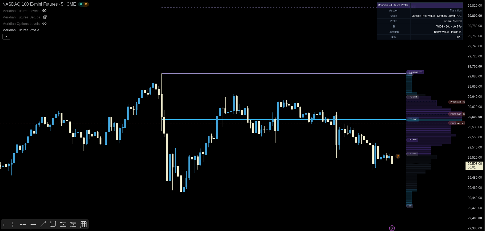

# Meridian — Futures Profile

[← Indicator documentation](../README.md) · [View source](../../src/futures/meridian-futures-profile.pine)

**Version:** 0.1.2<br>
**Status:** Preview<br>
**Primary markets:** NQ, MNQ, ES and MES

<p align="center"></p>

## Purpose

Futures Profile builds current and previous regular-session Time Price Opportunity profiles. It describes where the auction spent time, where value formed and how the current distribution relates to the prior completed session.

## TPO construction

The configured RTH session is divided into time blocks. Each completed block contributes one TPO to every price row traversed by that block. Row size can be selected manually or estimated from market tick size and a target row count.

The current profile includes the active block for display while preserving completed-block accounting for finalized statistics.

## Core statistics

- TPO Point of Control;
- Value Area High and Value Area Low;
- profile high, low and midpoint;
- TPO counts above and below POC;
- Initial Balance;
- rotation factor;
- single-print rows;
- poor high and poor low;
- previous-profile level tests and repairs.

## Profile classifications

The script uses deterministic shape rules to describe D, P, b, double-distribution and trend profiles. It also classifies value relationship, POC migration, opening location, current location and a basic Auction Market Theory state.

These labels summarize the current distribution. They are not forecasts.

## Estimated volume profile

The optional volume profile distributes each chart bar's volume uniformly across the rows crossed by that bar. It can estimate volume POC and value area, but it is not exchange-native volume at price and contains no bid/ask aggressor information.

## Recommended setup

```text
Market: active NQ, MNQ, ES or MES contract
Chart: 1–15 minutes, standard candles
RTH: 09:30–16:00 ET
TPO block: commonly 30 minutes
Row size: automatic first, then adjust for readability
Estimated volume: optional
```

## Important settings

| Group | Use |
|---|---|
| General | Enable state and chart-type warning |
| Session + TPO Blocks | RTH and block duration |
| Profile Rows | Automatic/manual row sizing and row limits |
| Profile Display | Width, placement, counts and current/previous visibility |
| Levels + Structure | POC, value, midpoint, IB, single prints and poor extremes |
| Estimated Volume Profile | Optional volume distribution and value area |
| Auction Classification | Shape and state thresholds |
| Theme / Dashboard | Colors and layout |
| Alerts + Telemetry | Level tests, repairs, auction changes and JSON |

## Alerts

Conditions cover tests of previous POC, VAH and VAL; entry into previous single-print zones; poor-high/poor-low repair; and auction-state changes.

## Limitations

- TPO precision depends on chart data, block duration and row size.
- Rendering limits can truncate unusually large profiles.
- Automatic row sizing is a usability heuristic.
- The volume profile is estimated from bars, not native exchange volume at price.
- Preview status means thresholds and display behavior can still change.

## Suggested companions

Use [Futures Levels](./futures-levels.md) for objective references and [Futures Context](./futures-context.md) for participation and regime.
