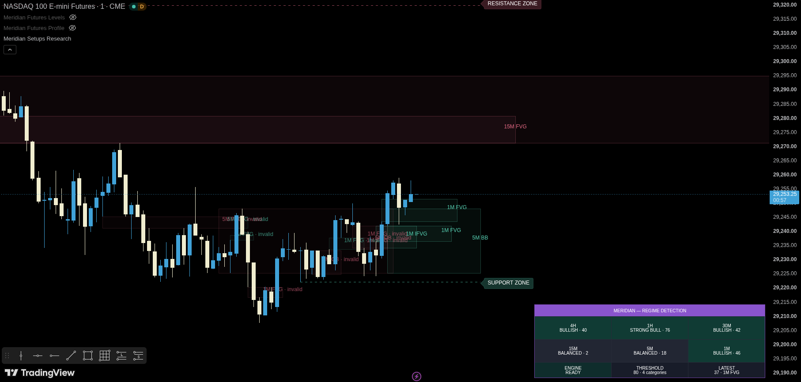

# Meridian — Futures Setups

[← Indicator documentation](../README.md) · [Daily source](../../src/futures/meridian-futures-setups.pine) · [Research source](../../src/futures/meridian-futures-setups-research.pine)

**Version:** 0.4.0-beta<br>
**Status:** Beta<br>
**Primary markets:** NQ, MNQ, ES and MES

<p align="center"></p>

## Purpose

Futures Setups is the qualification layer. It registers multi-timeframe FVG/IFVG/OB/BB zones, measures independent evidence, applies timing/risk/lifecycle gates and creates a temporary BUY or SELL **trade hypothesis** only for the strongest candidate that passes the complete model.

It does not place broker orders and its score is not a probability.

## Builds

| Build | Use |
|---|---|
| Daily | Restrained normal chart operation |
| Research | Same live qualification logic plus building zones, score tooltips, rejection reasons, liquidity lines and outcome counters |

Daily/research parity is statically validated by the repository tooling.

## v0.4 revamp

The beta engine keeps the existing qualification model and incorporates the useful architectural ideas extracted from the legacy liquidity/MSS/IFVG/Unicorn scripts without copying their weaker bias or fixed-point logic:

- standardized palette, small adjustable labels and simple top-right `Meridian -- Futures Setups` HUD;
- added `Automatic` / `Manual` zone-source mode with a compact chart-dependent HTF source ladder;
- added bounded historical zone-size percentiles on top of source-ATR normalization; extremely small/large distribution tails receive less authority;
- strengthened **causal event linkage** so an ordered liquidity sweep → structure/MSS → displacement sequence receives explicit chain authority rather than treating the events as unrelated checkboxes;
- enhanced same-direction overlap with extra authority when breaker/OB structure overlaps FVG/IFVG imbalance (`Zone Overlap Quality` concept);
- records the nearest eligible opposing objective in hypothesis evidence after objective-space qualification;
- research zones now use `BUILDING → CONFIRMED → INVALIDATED` visual semantics: gray ghost state while below the live threshold, directional color once qualified, and faded/frozen invalid history;
- retained correctly bounded IFVG and BB transformation lifetimes, first-touch/structural-leg gates and confirmed HTF payloads.

## Zone sources and lifecycle

The engine can register chart, 5m, 15m, 30m, 1H and 4H FVG/OB zones. An FVG can transform to IFVG after confirmed failure; an OB can transform to a Breaker Block. Transformed zones receive a new reduced timer rather than inheriting the old zone's remaining life.

Automatic source mode keeps the active source ladder compact for the execution chart; Manual mode exposes the individual source toggles.

## Liquidity and causal chain

Liquidity evidence can come from repeated-pivot pools and objective references including prior day/week, overnight and Opening Range levels. A sweep event is only one part of the chain.

The strongest execution evidence follows:

```text
liquidity sweep
      ↓
BOS / MSS confirmation
      ↓
directional displacement
      ↓
qualified FVG / IFVG / OB / BB interaction
```

The model gives more authority when those events occur in causal order within their configured validity windows.

Repeated-pivot pools are OHLC-derived proxies for clustered structural liquidity. They are not DOM/order-book liquidity.

## Scoring

The score remains capped at 100 and still requires independent evidence categories. Major families are:

- zone authority, now including ATR-normalized size distribution quality;
- multi-timeframe / zone overlap;
- execution structure, displacement and causal-chain quality;
- liquidity and objective references;
- context (VWAP/regime/z-score/RSI/RVOL);
- intermarket/session support including confirmed NQ/ES SMT.

Breaker/OB overlap with FVG/IFVG can strengthen overlap authority, but no overlap pattern can bypass the mandatory live gates by itself.

## Mandatory live gates

Depending on settings a hypothesis can require:

- supported symbol/timeframe and confirmed chart bar;
- signal window;
- active unexpired zone;
- touch-count and structural-leg availability;
- recent structure and displacement;
- score and independent-category minimums;
- valid stop geometry;
- sufficient space to the nearest eligible opposing structural objective;
- active-trade/cooldown limits.

The highest-scoring qualifying candidate wins the bar.

## Targets and lifecycle

The chart continues to show 1R, 1.5R and 2R analytical geometry. The engine also calculates the nearest eligible opposing liquidity/reference objective for the qualification gate and records it in hypothesis evidence.

Trade geometry freezes when the hypothesis stops, reaches 2R or reaches its configured time expiry. Historical drawings then fade and are deleted according to bounded retention settings.

## Research visuals

The research build can show gray `BUILDING` zones below the live score threshold, directional `CONFIRMED` zones, invalidated history, liquidity-pool lines and rejected candidate labels. These visuals do not change live eligibility.

## Recommended setup

```text
Market: NQ or ES (micro equivalents supported)
Primary chart: 1 minute
Optional diagnostic chart: 2–5 minutes when enabled
Extended hours: enabled
Futures session: 18:00–17:00 ET
Signal window: 08:00–16:00 ET
Source mode: Automatic
Minimum score: 80
Minimum categories: 4
Entry mode: Rejection close
```

## Alerts

Confirmed conditions cover BUY, SELL, 2R target and stop events. Optional JSON includes build, zone type, score and evidence.

## Limitations

The beta engine does not model commissions, slippage, fill priority or intrabar path. OHLC-derived liquidity is not order-book liquidity. Zone-size percentiles require warm-up history. Continuous-contract adjustments can alter historical zones. The model requires Bar Replay and live validation before performance claims.
