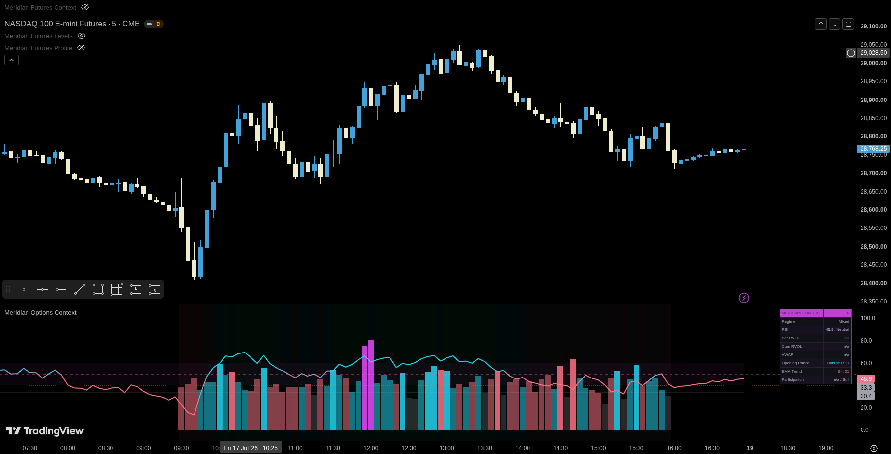

# Meridian — Options Context

[← Indicator documentation](../README.md) · [View source](../../src/options/meridian-options-context.pine)

**Version:** 0.1.1<br>
**Status:** Stable<br>
**Dependency:** `TradingView/ta/12`<br>
**Use on:** liquid options underlyings such as SPY and QQQ

<p align="center"></p>

## Purpose

Options Context is a lower-pane dashboard that measures whether momentum, participation and price location support the same directional interpretation. It is context, not a standalone entry signal.

## Core components

### RSI

Configurable RSI thresholds separate bullish, bearish and mixed momentum. Traditional 70/30 guides are optional.

### Same-time relative volume

The script uses TradingView's published technical-analysis library to compare current activity with equivalent offsets from prior daily anchors. It displays normalized columns while preserving the uncapped RVOL ratio in the dashboard.

### Regular-session VWAP

Daily RTH VWAP resets at the regular-session start. The context engine records whether price is above, below, reclaiming or losing VWAP.

### Opening Range

A configurable Opening Range provides location context: above, inside or below. Coarse chart bars can reduce boundary precision.

### EMA structure

Fast and slow EMAs contribute directional agreement when enabled.

## Context score

The transparent score combines enabled components. Positive values indicate bullish agreement, negative values indicate bearish agreement, and values near zero indicate mixed evidence. The score is not a probability or expected return.

## Recommended setup

```text
Chart: SPY or QQQ underlying
Timeframe: 1–15 minutes
Regular session: 09:30–16:00 ET
Opening Range: 15 minutes
RVOL history: 20 sessions
RSI: 14
```

## Important settings

| Group | Use |
|---|---|
| Session | Timezone, regular hours and Opening Range duration |
| RSI | Source, length and directional thresholds |
| Relative Volume | Lookback, real-time bar adjustment and participation thresholds |
| Context Engine | Select score components and thresholds |
| Visuals | Pane plots, guides and regime background |
| Dashboard | Position and size |
| Alerts | Momentum, RVOL, VWAP and OR event toggles |
| Colors | Bullish, bearish, neutral and accent palette |

## Alerts

Conditions cover strong bullish/bearish context transitions, high and extreme RVOL, VWAP reclaim/loss, and Opening Range breakouts or breakdowns with participation confirmation.

## Data behavior

RVOL needs historical anchors and can show a warm-up state. Current-bar RVOL can be estimated before a real-time bar closes when that setting is enabled. Use bar-close alerts for confirmed behavior.

## Limitations

- The script does not read option-chain data, Greeks or implied volatility.
- Sparse or irregular underlying volume reduces RVOL quality.
- The external TradingView library must be available to the user's account and Pine environment.
- A high score can occur after price is already extended; location and risk still matter.

## Companion

Use [Options Levels](./options-levels.md) on the price chart for the objective references being tested.
