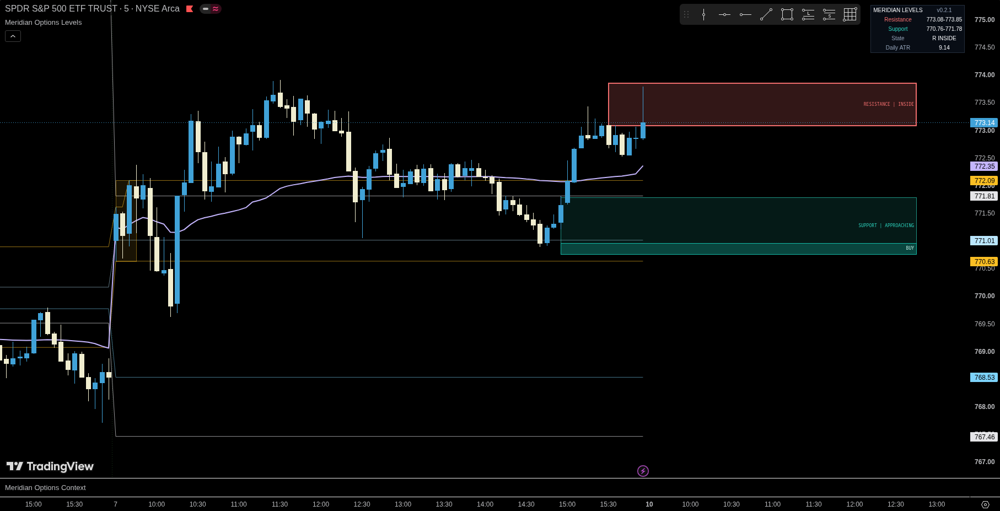

# Meridian — Options Levels

[← Indicator documentation](../README.md) · [View source](../../src/options/meridian-options-levels.pine)

**Version:** 0.2.1<br>
**Status:** Stable<br>
**Use on:** liquid US-listed options underlyings such as SPY and QQQ

<p align="center"></p>

## Purpose

Options Levels is a session-aware reaction-zone overlay for traders who want a small number of actionable areas instead of a chart filled with independent horizontal levels.

The indicator still calculates familiar references such as previous-session levels, premarket extremes, the Opening Range and RTH VWAP. In v0.2.1, those references feed a scoring and clustering engine that selects the strongest active support zone below price and resistance zone above price.

The result is intended to answer a focused question:

> **Where is price approaching an area with enough independent structural and reaction evidence to deserve attention?**

Options Levels analyzes the underlying security. It does not read option-chain Greeks, implied volatility, dealer positioning, individual contract liquidity or exchange order-book data.

## Default display

The default `Reaction Zones` mode keeps the chart intentionally compact:

- one active resistance reaction zone;
- one active support reaction zone;
- optional brighter `BUY` and `SELL` edge areas on qualifying zones;
- regular-session VWAP;
- optional ±1σ and ±2σ VWAP bands;
- optional Opening Range window highlight;
- a compact top-right dashboard showing active ranges, nearest state and confirmed daily ATR.

Zone text is deliberately minimal. The chart displays the role and current state, for example `SUPPORT | APPROACHING` or `RESISTANCE | INSIDE`, while internal scoring details remain available through debug and research outputs.

## How reaction zones are built

The engine creates a bounded registry of candidate references and evaluates only candidates close enough to current price to remain relevant.

Candidate sources can include:

| Source | Behavior |
|---|---|
| Previous day | Previous regular-session high, low and close |
| Previous week | Previous-week high and low |
| Premarket | Developing premarket high and low |
| Opening Range | Finalized OR high and low |
| RTH open | Current regular-session open |
| Swing pivots | Confirmed pivots using configurable left/right bars |
| Gap structure | Active session gap references when the gap exceeds the configured ATR threshold |
| Round numbers | Adaptive price increments based on the underlying price |
| RTH VWAP | Current regular-session VWAP |
| VWAP bands | Optional VWAP deviation-band candidates |
| Event AVWAP | Automatic earnings anchor, manual timestamp or disabled |
| ATR projections | Optional lower-priority projected references |

Each candidate receives an explainable quality score from the evidence that is actually available. Inputs include source authority, historical reaction quality, reaction impulse, touch quality, recency and bar participation. Missing evidence is omitted from the weighting rather than silently treated as zero.

Nearby candidates are then clustered using adaptive tolerances based on confirmed daily ATR, minimum tick size and price percentage. Cluster centers and widths are derived from the weighted distribution of their members rather than from a fixed arbitrary box size.

The final selection also applies **actionability**. A strong zone close to price can outrank a slightly stronger zone that is much farther away. A configurable switch margin provides hysteresis so small score changes do not continuously replace the displayed zones.

## Zone states

Each active zone moves through a deterministic lifecycle:

| State | Meaning |
|---|---|
| `DISTANT` | Valid zone, but price is not yet close enough to require attention |
| `APPROACHING` | Price is within the configured ATR-based approach distance |
| `INSIDE` | Current price is trading inside the zone |
| `REJECTING` | Price interacted with the zone and confirmed displacement away from it |
| `ACCEPTING` | Price is persisting in or through the zone rather than immediately rejecting |
| `BROKEN` | The configured break conditions have been confirmed |
| `FLIPPED` | A previously broken zone was later retested and confirmed from the opposite side |

Breaks and flips are confirmation-based. A wick through a boundary is not, by itself, enough to permanently redefine a zone.

## BUY and SELL edge areas

When enabled, v0.2.1 can draw a smaller brighter area at the outer edge of a sufficiently actionable reaction zone:

- `BUY` appears at the lower edge of a qualifying support zone.
- `SELL` appears at the upper edge of a qualifying resistance zone.

The edge area is derived from the parent zone and is gated by the zone's actionability score. Its minimum actionability and relative height are configurable.

These are **attention/entry areas, not standalone trade signals**. They do not model option selection, spread, fill quality, stop placement, position sizing or expected return. The parent zone state and broader market context should still be evaluated before acting.

## Display modes

| Mode | Purpose |
|---|---|
| `Reaction Zones` | Clean default view with selected zones, VWAP and optional visual aids |
| `Zones + Key References` | Adds the primary session and higher-timeframe references behind the reaction zones |
| `Legacy / Debug` | Exposes additional references, event AVWAP, gap structure, optional EMAs and the detailed scoring dashboard |

`Legacy / Debug` is intended for validation and investigation rather than normal chart use.

## Recommended setup

```text
Chart: SPY, QQQ or another liquid US-listed underlying
Timeframe: 1–15 minutes
Candles: standard
Extended hours: enabled when premarket levels are needed
Timezone: America/New_York
Regular session: 09:30–16:00 ET
Premarket: 04:00–09:30 ET
Opening Range: 15 minutes
Display mode: Reaction Zones
VWAP: enabled
VWAP bands: optional
BUY / SELL edge zones: enabled
```

The defaults are designed as a starting point, not universal optimization. Reaction behavior varies by symbol, timeframe and volatility regime.

## Important settings

| Group | Use |
|---|---|
| Sessions | Session timezone, RTH, premarket, weekday filter and Opening Range duration |
| Display | Display mode, zone text, dashboard, zone projection, edge areas, Opening Range highlight and colors |
| Reaction Zones | ATR normalization, cluster tolerance, zone width, actionability, switching and lifecycle thresholds |
| Candidate Sources | Enable or disable structural reference families and configure pivot/gap behavior |
| Reaction Model | Historical touch lookback, observation window, cooldown and touch tolerance |
| Event AVWAP | Automatic earnings, manual anchor or disabled mode plus age/distance controls |
| VWAP | RTH VWAP source, ±1σ/±2σ bands and optional legacy/debug EMAs |
| Dashboard & Alerts | Transition alerts and optional research values in the Data Window |

## VWAP and Opening Range

RTH VWAP resets at the detected regular-session open and uses the selected price source together with the chart symbol's volume.

The ±1σ and ±2σ bands can now be displayed in normal chart modes. They are presentation controls; whether VWAP bands also participate as reaction-zone candidates is configured separately under Candidate Sources.

The Opening Range develops for the configured number of minutes after the RTH open. Its high and low do not become reaction-zone candidates until the range is finalized. The optional transparent Opening Range box highlights the actual collection window on the chart.

## Dashboard

The top-right dashboard provides a compact summary of:

- active resistance range;
- active support range;
- state of the nearest active zone;
- confirmed daily ATR used by the normalization engine.

The normal dashboard intentionally does not expose candidate scores or confluence strings. Detailed strength, actionability, reaction quality and source information remain available in `Legacy / Debug`.

## Alerts

Available confirmed transition alerts are:

- Entered Resistance Zone
- Entered Support Zone
- Resistance Rejection
- Support Rejection
- Resistance Break / Acceptance
- Support Break / Acceptance
- Zone Flip
- New Higher-Quality Zone Selected

Alerts evaluate confirmed chart-bar transitions. TradingView alert frequency and delivery settings are still controlled by the alert created by the user.

## Research outputs

When `Show research values in Data Window` is enabled, the script exposes non-chart research series for:

- support zone low and high;
- support zone strength and actionability;
- resistance zone low and high;
- resistance zone strength and actionability;
- signed nearest-zone state.

These outputs are intended for validation and calibration without adding visual clutter to the normal chart.

## Calculation and data behavior

The indicator is intraday-only and raises a runtime error on non-intraday charts.

Previous-day, previous-week and confirmed daily-ATR values are based on completed higher-timeframe information. Confirmed swing pivots become eligible only after their right-side confirmation. The Opening Range becomes a candidate only after its configured window finishes.

Historical reaction scoring is bounded. Touches are evaluated with ATR/tick-aware tolerances and cooldowns to reduce repeated scoring of the same interaction. Candidate distance, pivot history and internal registries are also bounded to keep the script focused on currently relevant information.

## Limitations

- Reaction-zone scores are ranking tools, not probabilities, expected returns or win rates.
- BUY and SELL edge areas identify favorable locations inside qualifying zones; they do not constitute complete trade setups.
- The indicator analyzes the underlying security and does not know which option contract a trader intends to use.
- Historical reactions can change in usefulness across volatility regimes even when calculations are internally consistent.
- Premarket references require extended-hours bars from the chart feed.
- Opening Range precision depends on chart timeframe and session alignment.
- VWAP, volume and session values can vary slightly across data providers.
- Automatic event AVWAP availability depends on TradingView's earnings data for the selected symbol.
- Continuous, illiquid or irregularly traded symbols may produce less useful reaction statistics than liquid ETF underlyings.

## Companion

Use [Options Context](./options-context.md) below the chart to evaluate momentum, participation and directional environment around the active reaction zones.

Options Levels answers **where price matters**. Options Context is intended to help answer **what market environment is present when price gets there**.
