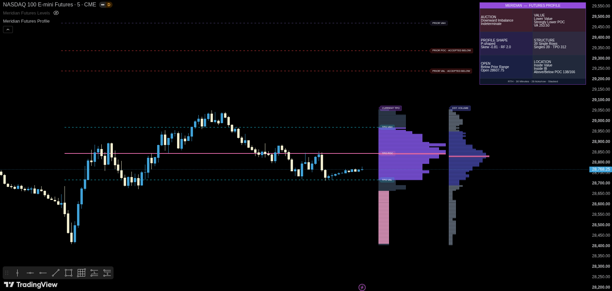

# Meridian — Futures Profile

[← Back to the main README](../README.md) · [View source](../indicators/futures/meridian-futures-profile/meridian-futures-profile-v0.1.1.pine)

  

## Purpose

**Meridian — Futures Profile** is a Time Price Opportunity and Auction Market Theory overlay for index futures. It builds a developing current RTH profile, retains the previous completed RTH profile, calculates value-area structure and classifies how the auction is developing.

Its primary question is:

> Where is the market accepting price, and how is value changing relative to the prior session?

The optional volume profile is explicitly estimated from chart bars. It is not exchange-native bid/ask footprint data.

## Best Use

- Markets: NQ, ES, MNQ and MES
- Chart type: standard time-based candles
- Typical chart timeframe: 1, 5 or 15 minutes
- Default TPO bracket: 30 minutes
- Default session: 09:30–16:00 ET RTH

## TPO Profile Construction

### TPO blocks

The RTH session is divided into configurable 5, 10, 15, 30 or 60-minute brackets. Within each bracket, every price row touched by the bracket receives one TPO count.

A row is incremented once per TPO block, even if multiple chart bars within that block revisit it. The active developing block can be included provisionally in the displayed current profile and is committed when the block ends.

### Row size

Two modes are available:

- **Manual:** a fixed number of ticks per row
- **Auto:** choose ticks per row from the previous profile range and the target row count

Conceptually:

$$
TicksPerRow = \left\lceil\frac{PreviousRange/TickSize}{TargetRows}\right\rceil
$$

A minimum tick size is applied. Default fallbacks are tailored to NQ/MNQ and ES/MES.

### Rendering limits

The mathematical maps remain intact even when the profile contains more rows than the drawing budget. The visual renderer groups rows when necessary so Pine drawing limits are respected.

## Core Profile Statistics

### TPO Point of Control

The TPO POC is the row with the largest TPO count. If several rows tie:

1. the row closer to the profile midpoint is preferred;
2. if equally distant, the higher row is selected.

### Value Area

The default target is 70% of total TPO count.

1. Start with the POC row.
2. Compare the next row above and below the current value area.
3. Add the side with the larger TPO count.
4. Continue until the target percentage is included.

The top boundary becomes TPO VAH and the bottom boundary becomes TPO VAL.

### Additional statistics

- profile high and low
- profile midpoint
- session open and close
- total TPO count
- TPO count above and below POC
- weighted mean row
- distribution skewness
- rotation factor
- Initial Balance high/low
- configurable IB extensions

## Initial Balance

The Initial Balance is defined by a configurable number of TPO blocks. With two 30-minute blocks, the IB is the conventional first hour.

$$
IBRange = IBH - IBL
$$

Extension levels are projected from IBH and IBL:

$$
UpperExtension_p = IBH + p\times IBRange
$$

$$
LowerExtension_p = IBL - p\times IBRange
$$

## Structural Anomalies

### Single prints

A non-extreme row with exactly one TPO is classified as a single-print row. Adjacent single rows from the previous completed profile are merged into zones.

The script tracks whether a zone is:

- untested
- tested
- repaired

### Poor high and poor low

A profile extreme is considered poor when the extreme row contains more than one TPO. The previous poor high/low can be extended until later price action repairs it.

### Prior profile level states

Previous POC, VAH and VAL can be classified through interaction states such as:

- tested
- reclaimed
- lost
- rejected
- accepted above
- accepted below

Acceptance uses the configured number of closes beyond the reference.

## Profile Shape Classification

The current profile is classified with deterministic rules.

### D-shaped

- low absolute skewness
- POC in the central portion of the profile
- no stronger double-distribution or trend condition

### P-shaped

- distribution skew and POC location indicate heavier upper acceptance with a lower stem

### b-shaped

- distribution skew and POC location indicate heavier lower acceptance with an upper stem

### Double Distribution

The script searches for a secondary peak separated from the primary POC. By default:

- secondary peak must be at least 62% of the primary peak
- peaks must be at least five rows apart
- the valley between them must be no more than 55% of the smaller peak

All thresholds are configurable.

### Trend Profile

A trend profile requires profile range to exceed the Initial Balance by the configured multiple—1.75 by default—plus an extreme POC location or sufficiently large skew.

These labels describe geometry. They are not direct trade signals.

## Value and POC Migration

### Value relationship

The current value area is compared with the previous value area:

- Higher Value
- Lower Value
- Overlapping Higher
- Overlapping Lower
- Inside Prior Value
- Outside Prior Value
- Overlapping Value

### POC migration

POC movement is normalized by current row size:

$$
POCMigrationRows = \frac{CurrentPOC-PreviousPOC}{CurrentRowSize}
$$

The dashboard reports Strongly Higher, Higher, Stable, Lower or Strongly Lower.

### Opening location

The current RTH open is classified relative to the prior profile:

- Above Prior Range
- Above Prior Value
- Inside Prior Value
- Below Prior Value
- Below Prior Range

### Current location

Current price is classified relative to the developing profile, value area and POC.

## Auction Market Theory Classification

The dashboard combines shape, value migration, POC migration, IB location and opening behavior into these states:

- Double Distribution
- Failed Upward Auction
- Failed Downward Auction
- Upward Trend Auction
- Downward Trend Auction
- Upward Imbalance
- Downward Imbalance
- Balanced Auction
- Developing Balance
- Transition

Participant-behavior labels include:

- Initiative Buying
- Initiative Selling
- Responsive Buying
- Responsive Selling
- Two-sided Trade
- Indeterminate

For example, upward value, a higher POC and trade above IB or VAH can support an Initiative Buying classification. An open above prior value followed by a return into prior value can support Responsive Selling or a Failed Upward Auction.

## Estimated Volume Profile

The optional estimated profile distributes each confirmed chart bar's volume uniformly across every profile row touched by that bar.

For a bar touching $N$ rows:

$$
EstimatedVolumePerRow = \frac{BarVolume}{N}
$$

The script then calculates estimated VPOC, VAH and VAL using the same adjacent-row expansion principle as the TPO value area.

This is useful for comparing time acceptance with an approximate volume distribution, but it has important limits:

- it does not know the true intrabar path
- it does not know bid versus ask aggressor volume
- it is not a footprint or Depth of Market feed

## Dashboard

The six cards show:

- Auction state and participant behavior
- Value relationship and POC migration
- Profile shape and rotation/skew statistics
- Structural anomalies
- Opening location
- Current location within the profile

When `Layout with Futures Levels` is enabled, the Profile dashboard uses the top-right corner so it can stack above the Futures Levels dashboard.

## Alerts

Available alert families include:

- previous POC/VAH/VAL interaction
- prior single-print interaction or repair
- poor-high/poor-low repair
- auction-state changes

Optional JSON telemetry includes the profile shape, auction state, value relationship, POC and profile-location information.

## Important Settings

| Group | Setting | Effect |
|---|---|---|
| Session + TPO Blocks | Block size | Controls TPO bracket duration |
| Profile Rows | Row-size mode | Selects automatic or manual tick size |
| Profile Rows | Value area percentage | Controls TPO VAH/VAL coverage |
| Profile Display | Width, offsets and profiles | Controls current/previous rendering |
| Levels + Structure | IB, single prints and prior levels | Controls structural overlays |
| Estimated Volume | Volume profile and value area | Enables the approximate volume profile |
| Auction Classification | Shape thresholds | Controls double-distribution, skew and trend rules |
| Dashboard | Layout with Futures Levels | Prevents dashboard overlap |

## Limitations

- The profile uses chart data, so the chart timeframe determines available intrabar precision.
- Non-standard candles can distort ranges and volume.
- Auto row size is based on prior profile range and can change between sessions.
- The active TPO block is provisional until completed.
- The estimated volume profile is not exact volume at price.
- Profile and auction classifications are descriptive rules, not forecasts.
- Pine drawing limits require bounded and sometimes compressed visual rendering.

## Suggested Companions

- [Meridian — Futures Levels](./meridian-futures-levels.md)
- [Meridian — Futures Context](./meridian-futures-context.md)

## License

This source file is covered by the repository's [MPL-2.0 license](../LICENSE).
