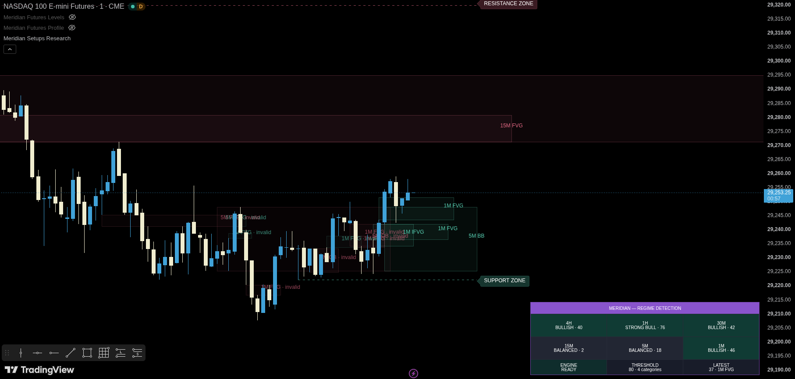

# Meridian — Futures Setups

> **Status: Beta · Work in progress**

[← Documentation index](./README.md) · [Main repository README](../README.md) · [View Pine source](../indicators/futures/meridian-futures-setups/meridian-futures-setups-v0.2.pine)

<p align="center">
  <a href="../screenshots/Meridian_Futures_Setups.png">
    
  </a>
</p>

> The screenshot file is reserved as `screenshots/Meridian_Futures_Setups.png`. Add the final beta screenshot when the visual design is ready.

## Purpose

Meridian — Futures Setups is a stateful setup scanner for NQ, MNQ, ES and MES. It continuously registers liquidity, structure, displacement, setup zones, session context and NQ/ES SMT divergence. The chart remains clean until a complete setup passes its mandatory gates, reaches the required confluence score and confirms its entry rule.

The indicator does not place broker orders. `BUY` and `SELL` markers are rule-based trade hypotheses.

## Recommended chart configuration

- Primary timeframe: 1 minute
- Supported working timeframes: 1, 3, 5 and 15 minutes
- Markets: NQ, MNQ, ES and MES
- Chart type: standard candles
- Session: extended hours
- Default timezone: `America/New_York`
- Initial strategy: `Meridian Choice`
- Initial scoring profile: `Balanced`
- Normal display mode: `Minimal` or `Signals`

Use `Research` mode only when you need to inspect qualification state, rejected candidates or scoring diagnostics.

## Core design

The indicator separates four systems:

1. **Strategy Mode** defines the playbook.
2. **Concept Family** limits eligible zone types.
3. **Scoring Profile** controls qualification strictness.
4. **Entry Mode** controls the final trigger.

Concepts do not create independent signals by themselves. They provide evidence to a shared setup lifecycle.

## Strategy modes

### Meridian Choice

Meridian Choice is the general confluence scanner. It can qualify an FVG, IFVG, Order Block or Breaker Block when the selected liquidity, structure, displacement, session, zone-quality and score rules pass.

### Unicorn Model

The current Meridian implementation requires:

- Registered liquidity sweep and reclaim
- Confirmed Market Structure Shift
- Valid displacement
- Breaker Block and FVG/IFVG overlap
- Valid qualification window
- Acceptable zone size
- Score at or above the selected threshold

When `Entry mode` is `Strategy defined`, the Unicorn Model uses a consequent-encroachment trigger.

### Silver Bullet

The current Meridian implementation requires:

- A configured New York time window
- Registered liquidity sweep and reclaim
- Confirmed Market Structure Shift
- Valid displacement
- A fresh displacement-created FVG
- Acceptable zone size
- Score at or above the selected threshold

Default New York windows:

- 03:00–04:00: disabled
- 10:00–11:00: enabled
- 14:00–15:00: enabled

When `Entry mode` is `Strategy defined`, Silver Bullet uses consequent encroachment.

### All Enabled

This mode evaluates Meridian Choice, Unicorn Model and Silver Bullet at the same time. If several strategies match one zone, the indicator keeps one setup and records all matches. It does not create duplicate overlapping trades for the same zone.

### Custom Confluence

This mode uses the user-defined score threshold and mandatory gates. The user can require:

- Sweep and reclaim
- MSS
- Displacement
- SMT
- Session window

## Concept families

The user can limit eligible setup zones to:

- All
- FVG
- IFVG
- OB
- BB

The internal engine can continue to track supporting concepts because some strategies require relationships between more than one zone type.

## Liquidity registry

The script can register:

- Prior-day high and low
- Prior-week high and low
- Overnight high and low
- Opening Range high and low
- Initial Balance high and low
- Confirmed chart pivots
- Confirmed 15-minute, 1-hour, 4-hour and daily highs and lows

Liquidity states distinguish:

- Active
- Touched
- Penetrated
- Reclaimed
- Accepted
- Consumed
- Expired

A simple touch is not automatically classified as a reversal sweep.

## Structure and displacement

The setup engine evaluates:

- Confirmed Break of Structure
- Confirmed Market Structure Shift
- Candle body divided by ATR
- Body-to-range fraction
- Close location within the candle
- Directional efficiency
- Same-time-of-day RTH RVOL
- Rolling realized-volatility context

Confirmed pivots are acted on after their right-side confirmation bars complete. Pivot-dependent events are recorded on the confirmation bar, not moved backward to the pivot origin.

## Zone engines

### FVG

The indicator detects bullish and bearish three-candle Fair Value Gaps. It tracks age, fill percentage, first touch, invalidation and expiry.

### IFVG

An FVG can invert after a confirmed close through its invalidating boundary. The new zone is tracked in the opposite direction.

### Order Block

An Order Block must be connected to validated displacement and structure. The indicator does not classify every opposing candle as an Order Block.

### Breaker Block

A Breaker Block is transformed from a failed Order Block after the required directional and structural conditions pass.

## NQ/ES SMT

The indicator supports automatic NQ-to-ES and ES-to-NQ pairing. It can also use a manual comparison symbol.

SMT uses confirmed pivot divergence and an ATR-normalized divergence threshold. SMT is confluence only. It cannot create a setup by itself.

## Confluence scoring

The score combines seven capped categories:

| Category | Default maximum |
|---|---:|
| Liquidity event | 20 |
| Displacement and structure | 20 |
| Zone quality | 20 |
| Higher-timeframe context | 15 |
| SMT confirmation | 10 |
| Session and participation | 10 |
| Premium or discount location | 5 |

The result is normalized to a value from 0 to 100. The score is not a probability and is not a historical win rate.

### Scoring profiles

| Profile | Default threshold | Core behavior |
|---|---:|---|
| Strict | 75 | Requires sweep, MSS, displacement and session |
| Balanced | 65 | Requires sweep, structure, displacement and session |
| Aggressive | 55 | Requires sweep, structure and session |
| Research | 0 | Reduces hard gates for diagnostics |
| Custom | User-defined | Uses custom mandatory gates |

Mandatory gates remain separate from the score. A high score cannot replace a required event.

## Entry and trade lifecycle

A setup can progress through these states:

```text
Detected
→ Candidate
→ Qualified
→ Armed
→ Entry pending
→ Triggered
→ Active
→ Partial target
→ Completed, stopped or time expired
→ Faded retention
→ Removed
```

Entry options include:

- Strategy defined
- First touch
- Consequent encroachment
- Confirmed rejection

## Stop system

### Invalidation Boundary

This is the default and tightest standard mode.

- Bullish stop: below the far boundary of the setup zone
- Bearish stop: above the far boundary of the setup zone
- Configurable tick buffer

### Sweep Extreme

The stop is placed beyond the linked liquidity-sweep extreme.

### Structure Swing

The stop is placed beyond the latest confirmed swing that supports the trade direction.

### Stop-size filters

The script can reject a setup before entry when the required stop is unsuitable.

Initial automatic limits:

- NQ/MNQ maximum: 32 ticks
- ES/MES maximum: 12 ticks
- Maximum stop divided by ATR: 0.75
- Minimum stop: 2 ticks

These values are provisional research defaults.

## Risk and reward display

After entry, the indicator shows:

- A compact `BUY` or `SELL` marker
- No entry line
- Transparent red shading from entry to stop
- Tiered green shading from entry to 1R, 1R to 1.5R and 1.5R to 2R
- Bright stop line
- Bright 1R, 1.5R and 2R target lines

The far reward tiers use lighter transparency so that the nearest objective remains visually strongest.

## Trade duration and retention

The default active duration is 30 minutes.

Trade drawings end at the earliest of:

- Stop hit
- 2R hit
- Active-duration expiry

Time-expired outcomes can show `TIME`, `TIME +1R` or `TIME +1.5R`.

Default terminal retention:

- Drawings fade when the trade becomes terminal.
- Drawings remain visible for 5 minutes.
- The trade is then removed.

When **Show past trades** is enabled:

- Terminal trades remain in a faded historical state.
- Default retention is 22 hours.
- Retention is configurable.
- A hard retained-trade limit prevents drawing exhaustion.

## Display modes

| Mode | Visible output |
|---|---|
| Minimal | Armed zones and active or briefly retained trades |
| Signals | Triggered trades and outcomes |
| Qualified Zones | Qualified and armed candidate zones |
| All Concepts | Broader zone and concept diagnostics |
| Research | Qualification reasons, scores and engine status |

Research mode is intentionally more cluttered than normal operation.

## Confirmed-only execution model

The critical setup path uses confirmed bars:

- Higher-timeframe values use completed HTF bars.
- Confirmed HTF requests use completed `[1]` expressions.
- Chart pivots are used after confirmation.
- Zone qualification, scoring and entries are processed on confirmed bars.
- Historical stop and target checks begin after the entry bar.
- When a later OHLC candle contains both a stop and target, the overlay uses a conservative stop-first rule.

This prevents the script from drawing an earlier historical signal that was not knowable at the time. It does not provide intrabar sequencing that is absent from OHLC data.

## Alerts

Static and optional JSON events include:

- Candidate armed
- Entry triggered
- Target reached
- Stop reached
- Candidate expired
- Candidate superseded
- Trade time expired
- Trade completed

The JSON schema is `meridian.futures_setups.event.v2`.

## Important limitations

- The indicator does not place orders.
- It does not use footprint, DOM or resting-order-book data.
- OHLC bars do not show the exact order of intrabar stop and target events.
- Continuous futures symbols can have rollover and back-adjustment effects.
- Strategy names refer to Meridian's documented rule definitions. Public descriptions can differ.
- Stop limits, score thresholds and strategy rules remain under beta validation.
- A dedicated Strategy Tester companion is a separate future deliverable.

## Beta validation checklist

Before relying on a new release:

1. Compile the source in TradingView Pine Editor.
2. Test NQ and ES separately.
3. Test a 1-minute extended-hours chart.
4. Verify one bullish and one bearish setup in Replay.
5. Confirm that the signal appears only after the qualifying candle closes.
6. Confirm that no pivot-based signal is backfilled onto an earlier bar.
7. Confirm that the stop, target and 30-minute expiry end the active drawings.
8. Confirm that five-minute cleanup works with past trades disabled.
9. Enable past trades and confirm faded 22-hour retention.
10. Use Research mode to inspect rejected setup reasons.

## Development status

Futures Setups is a **beta and work in progress**. The source is public so that compiler fixes, calculation changes and lifecycle adjustments can be reviewed through Git history. The indicator will continue to receive validation, visual cleanup and strategy-definition updates.

## License

This source is covered by the repository's [Mozilla Public License 2.0](../LICENSE). The license does not grant rights to the Meridian Trading name, logos, branding, premium products or private infrastructure.
